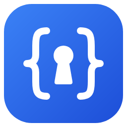

<p align="center"></p>

# User Secret Manager

.NET projelerindeki `appsettings*.json` dosyalarında duran hassas değerleri (connection string, parola, API anahtarı…)
**sizin seçtiğiniz** anahtarlar üzerinden `dotnet user-secrets` deposuna taşıyan, appsettings'ten temizleyen ve
secret'ları görüntüleyip yönetmenizi sağlayan çapraz platform masaüstü uygulaması.

- Solution (`.sln`, `.slnx`) veya proje (`.csproj`, `.fsproj`, `.vbproj`) ekleyin; liste hatırlanır.
- Anahtar × ortam matrisinde (Base, Development, Production…) hassas olabilecek anahtarlar işaretlenir; seçim sizindir.
- Farklı ortamlarda farklı değerler varsa çakışma gösterilir; hangi değerin secret olacağını seçersiniz.
- Değişiklikler uygulanmadan önce satır satır diff önizlemesi gösterilir. Yorumlar, girinti ve BOM korunur.
- Her işlem yedeklenir; **Geçmiş** sekmesinden tek tıkla geri alınır.
- Secret'ları görüntüleyin, düzenleyin, silin veya appsettings'e geri taşıyın.
- `ocelot.json`, `serilog.json` gibi ek JSON yapılandırma dosyalarını projeye ekleyin.
- **Etkin yapılandırma:** seçilen ortam ve launch profili için uygulamanın göreceği son değerleri, kaynaklarını ve
  boş kalan anahtarları görün.
- **Profiller:** aynı secret anahtarlarının farklı değerlerle şifreli, adlandırılmış kopyaları (Local, Staging DB…);
  değerleri profilde düzenleyin, tek adımda uygulayın.
- **Aktarım:** secret'ları parolalı dosya ile dışa/içe aktarın; ekip için `secrets.template.json` üretin.

Tasarım kararları ve gerekçeleri: [docs/ANALYSIS.md](docs/ANALYSIS.md).

## Önemli: user secrets yalnızca Development içindir

.NET varsayılan olarak user secrets'ı **yalnızca `Development` ortamında** yükler ve proje başına tek bir
`secrets.json` vardır. Bu yüzden:

- Varsayılan secret değeri, Development'ta etkin olan değerdir (mevcut secret > `appsettings.Development.json` > `appsettings.json`).
- Production/Staging dosyalarındaki değerler varsayılan olarak **temizlenmez**. Temizlemeyi seçerseniz o ortamda değeri
  ortam değişkeni (ör. `ConnectionStrings__Default`) veya bir secret vault ile sağlamanız gerekir.

## Kurulum

[Son sürüm](https://github.com/mehmedozdemir/UserSecretManager/releases/latest) sayfasından:

| Platform | Dosya | Not |
|---|---|---|
| Windows | `UserSecretManager.Desktop-win-Setup.exe` | Kullanıcı bazında kurulur (yönetici izni gerekmez), Başlat menüsüne eklenir, "Güncellemeleri denetle" ile kendini günceller. |
| Windows (kurulumsuz) | `UserSecretManager.Desktop-win-Portable.zip` | Açıp `User Secret Manager.exe`'yi çalıştırın. |
| Linux x64 | `UserSecretManager-vX.Y.Z-linux-x64.tar.gz` | Tek dosya, .NET gerektirmez. |
| macOS (Apple Silicon) | `UserSecretManager-vX.Y.Z-osx-arm64.tar.gz` | Tek dosya; imzasız olduğu için `xattr -d com.apple.quarantine UserSecretManager`. |

Paketler imzalı değildir; Windows SmartScreen "Yine de çalıştır" isteyebilir. Bütünlük için `SHA256SUMS.txt`.
Kaldırma (Ayarlar → Uygulamalar) yalnızca uygulamayı siler; proje listesi, profiller ve yedekler
`%LocalAppData%\UserSecretManager` altında kalır.

## Gereksinimler

- Çalıştırmak için: hiçbir şey (paketler self-contained)
- Derlemek için: .NET SDK 10.0
- Windows 10+, macOS 12+ veya bir X11/Wayland Linux masaüstü

## Hızlı başlangıç

```bash
dotnet run --project src/UserSecretManager.App
```

## Derleme ve test

```bash
dotnet build UserSecretManager.slnx
dotnet test  UserSecretManager.slnx
```

Tüm dağıtım paketleri (Windows kurulum + taşınabilir, Linux, macOS):

```powershell
./scripts/package.ps1            # artifacts/<sürüm>/dist
./scripts/package.ps1 -Upload    # ayrıca GitHub'daki vX.Y.Z sürümüne yükler
```

## Yapılandırma

Uygulama ortam değişkeni gerektirmez. İsteğe bağlı:

| Değişken | Açıklama |
|---|---|
| `USERSECRETMANAGER_DATA_DIR` | Proje listesi ve yedeklerin tutulduğu klasör. Varsayılan: `LocalApplicationData/UserSecretManager` |

Uygulama verileri:

| Dosya | İçerik |
|---|---|
| `workspace.json` | Eklenen solution/projeler, favoriler, tema. **Secret değeri içermez.** |
| `backups/<tarih>/` | Her işlemden önceki dosya kopyaları (son 50 işlem). `secrets.json` ile aynı güven seviyesinde, kullanıcı profilinizde durur. |
| `profiles/<UserSecretsId>/` | Şifreli secret profilleri. Windows'ta DPAPI (kullanıcı hesabına bağlı); macOS/Linux'ta `profiles.key` ile AES-256-GCM. |
| `profiles.key` | Yalnızca macOS/Linux: profil anahtarı, sadece kullanıcı okuyabilir (`600`). Silinirse profiller açılamaz. |

## Mimari

```
src/UserSecretManager.Core   UI bağımsız çekirdek: JSON işleme, keşif, planlama, yedekleme
src/UserSecretManager.App    Avalonia 12 masaüstü uygulaması (MVVM, CommunityToolkit.Mvvm)
tests/UserSecretManager.Core.Tests
docs/                        Analiz ve mimari kararlar (ADR)
```

## Katkı

Dal stratejisi, commit formatı, CHANGELOG kuralları ve sürüm yayınlama adımları: [CONTRIBUTING.md](CONTRIBUTING.md).
